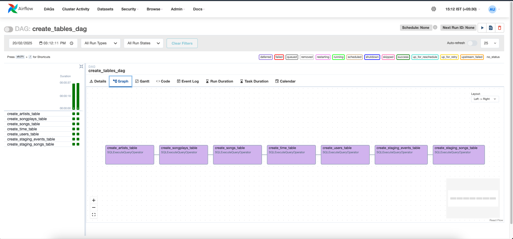
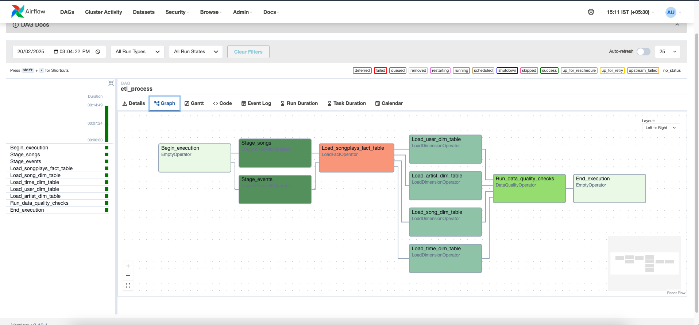

# 🚀 Data Pipelines with Apache Airflow

## 📌 Project Overview
This project builds an **ETL pipeline** for Sparkify, a music streaming service, using **Apache Airflow** and **Amazon Redshift**. It automates data ingestion, transformation, and validation for structured analytics.

### **🌟 Features**
✅ **Airflow DAGs** to orchestrate data pipeline  
✅ **Redshift Warehouse** for scalable analytics  
✅ **Custom Airflow Operators** for ETL tasks  
✅ **Data Quality Checks** to ensure integrity  
✅ **Dynamic and Reusable** pipeline  

---

## 📁 Project Structure

## 🛠️ **DAGs & Workflow**
### **1️⃣ Create Tables DAG**
This DAG initializes the Redshift database by creating required tables.

### **2️⃣ ETL DAG**
This DAG performs the ETL process:
1. **Extract** logs & songs data from S3  
2. **Transform** raw data into structured analytics tables  
3. **Load** into Redshift for querying  

---

## 🚀 **Technologies Used**
- 🏗 **Apache Airflow** - Orchestration  
- ☁️ **Amazon S3** - Data Storage  
- 🔴 **Amazon Redshift** - Data Warehouse  
- 🐍 **Python** - ETL Scripts  
- 🔍 **SQL** - Data Transformation

- 
